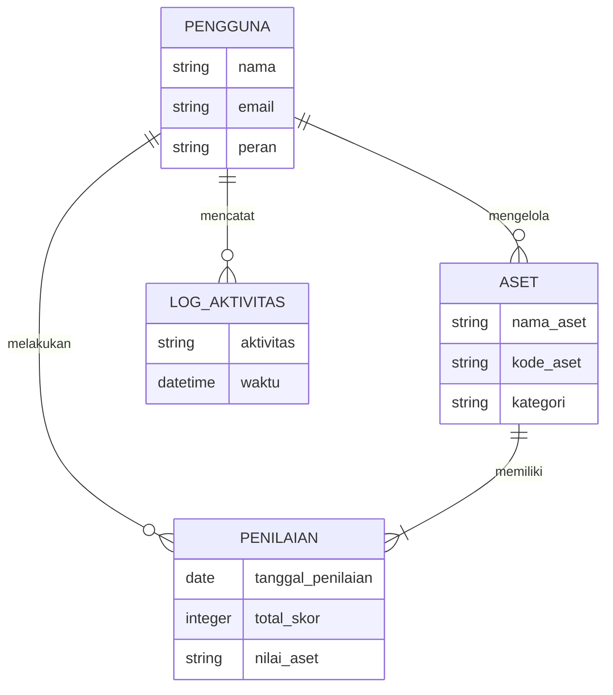
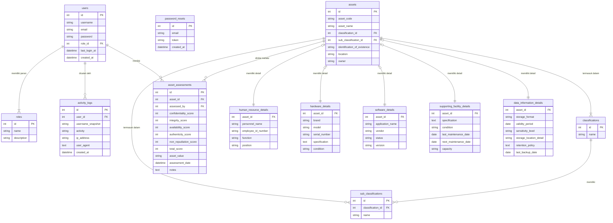

# Dokumentasi Desain Database: SI-PAKAT

Dokumen ini merinci desain database untuk aplikasi SI-PAKAT, mulai dari level konseptual hingga fisik, menggunakan format Entity-Relationship Diagram (ERD).

## 1. Conceptual Data Model (CDM)

Model ini menggambarkan entitas utama dalam sistem dan bagaimana mereka saling berhubungan secara konseptual. Tujuannya adalah untuk memahami domain bisnis tanpa terlalu teknis.



**Entitas Utama:**
-   **PENGGUNA**: Mewakili individu yang dapat login dan berinteraksi dengan sistem.
-   **ASET**: Mewakili item inventaris TIK yang dikelola, seperti hardware, software, atau data.
-   **PENILAIAN**: Mewakili catatan penilaian keamanan yang dilakukan terhadap sebuah aset.
-   **LOG_AKTIVITAS**: Mewakili catatan jejak audit dari setiap tindakan penting yang dilakukan oleh pengguna.

---

## 2. Logical Data Model (LDM)

Model ini lebih detail, menjabarkan setiap entitas menjadi tabel dengan atribut, *Primary Key* (PK), dan *Foreign Key* (FK). Model ini masih independen dari implementasi database spesifik.


**Penjelasan Relasi:**
-   Setiap `user` memiliki satu `role`.
-   Setiap `asset` memiliki satu `classification` dan bisa memiliki satu `sub_classification`.
-   Setiap `asset` dapat memiliki banyak `asset_assessments` (riwayat penilaian).
-   Setiap `asset` hanya memiliki detail di salah satu tabel anak (misal: `hardware_details`), tergantung pada `classification_id`-nya. Relasi ini bersifat 1-ke-1 opsional.

---

## 3. Physical Data Model (PDM)

Model ini adalah representasi fisik dari LDM yang akan diimplementasikan di **MySQL**. Ini mencakup tipe data spesifik, *constraint* `NOT NULL`, `AUTO_INCREMENT`, dan `INDEX`.

```mermaid
erDiagram
    users {
        INT id PK "AUTO_INCREMENT"
        VARCHAR(255) username "NOT NULL"
        VARCHAR(255) email "NOT NULL, UNIQUE"
        VARCHAR(255) password "NOT NULL"
        INT role_id "FK, NOT NULL"
        TIMESTAMP last_login_at "NULL"
        TIMESTAMP created_at "DEFAULT CURRENT_TIMESTAMP"
    }
    roles {
        INT id PK "AUTO_INCREMENT"
        VARCHAR(255) name "NOT NULL"
        VARCHAR(255) description
    }
    activity_logs {
        INT id PK "AUTO_INCREMENT"
        INT user_id "FK, NULL, ON DELETE SET NULL"
        VARCHAR(255) username_snapshot "NULL"
        VARCHAR(255) activity "NOT NULL"
        VARCHAR(45) ip_address "NULL"
        TEXT user_agent "NULL"
        TIMESTAMP created_at "DEFAULT CURRENT_TIMESTAMP"
    }
    password_resets {
        INT id PK "AUTO_INCREMENT"
        VARCHAR(255) email "NOT NULL"
        VARCHAR(255) token "NOT NULL, UNIQUE"
        TIMESTAMP created_at "DEFAULT CURRENT_TIMESTAMP"
    }
    assets {
        INT id PK "AUTO_INCREMENT"
        VARCHAR(255) asset_code "NOT NULL, UNIQUE"
        VARCHAR(255) asset_name "NOT NULL"
        INT classification_id "FK, NOT NULL"
        INT sub_classification_id "FK, NULL"
        VARCHAR(255) identification_of_existence "NOT NULL"
        VARCHAR(255) location "NOT NULL"
        VARCHAR(255) owner "NOT NULL"
    }
    classifications {
        INT id PK "AUTO_INCREMENT"
        VARCHAR(255) name "NOT NULL"
    }
    sub_classifications {
        INT id PK "AUTO_INCREMENT"
        INT classification_id "FK, NOT NULL"
        VARCHAR(255) name "NOT NULL"
    }
    asset_assessments {
        INT id PK "AUTO_INCREMENT"
        INT asset_id "FK, NOT NULL, ON DELETE CASCADE"
        INT assessed_by "FK, NOT NULL"
        TINYINT confidentiality_score "NOT NULL"
        TINYINT integrity_score "NOT NULL"
        TINYINT availability_score "NOT NULL"
        TINYINT authenticity_score "NOT NULL"
        TINYINT non_repudiation_score "NOT NULL"
        INT total_score "GENERATED"
        VARCHAR(50) asset_value "GENERATED"
        TIMESTAMP assessment_date "DEFAULT CURRENT_TIMESTAMP"
        TEXT notes "NULL"
    }
    human_resource_details {
        INT asset_id PK "FK, ON DELETE CASCADE"
        VARCHAR(255) personnel_name "NULL"
        VARCHAR(255) employee_id_number "NULL"
        VARCHAR(255) function "NULL"
        VARCHAR(255) position "NULL"
    }
    hardware_details {
        INT asset_id PK "FK, ON DELETE CASCADE"
        VARCHAR(255) brand "NULL"
        VARCHAR(255) model "NULL"
        VARCHAR(255) serial_number "NULL"
        TEXT specification "NULL"
        VARCHAR(100) `condition` "NULL"
    }
    software_details {
        INT asset_id PK "FK, ON DELETE CASCADE"
        VARCHAR(255) application_name "NULL"
        VARCHAR(255) vendor "NULL"
        VARCHAR(100) status "NULL"
        VARCHAR(100) version "NULL"
    }
    supporting_facility_details {
        INT asset_id PK "FK, ON DELETE CASCADE"
        TEXT specification "NULL"
        VARCHAR(100) `condition` "NULL"
        DATE last_maintenance_date "NULL"
        DATE next_maintenance_date "NULL"
        VARCHAR(255) capacity "NULL"
    }
    data_information_details {
        INT asset_id PK "FK, ON DELETE CASCADE"
        VARCHAR(100) storage_format "NULL"
        DATE validity_period "NULL"
        VARCHAR(100) sensitivity_level "NULL"
        VARCHAR(255) storage_location_detail "NULL"
        TEXT retention_policy "NULL"
        DATE last_backup_date "NULL"
    }

    users }o--|| roles : "role_id(id)"
    users }o--o{ activity_logs : "user_id(id)"
    users }o--o{ asset_assessments : "assessed_by(id)"
    assets }o--|| classifications : "classification_id(id)"
    assets }o--o| sub_classifications : "sub_classification_id(id)"
    assets }o--|| asset_assessments : "asset_id(id)"
    classifications }o--|| sub_classifications : "classification_id(id)"
    assets }o-o| human_resource_details : "id(asset_id)"
    assets }o-o| hardware_details : "id(asset_id)"
    assets }o-o| software_details : "id(asset_id)"
    assets }o-o| supporting_facility_details : "id(asset_id)"
    assets }o-o| data_information_details : "id(asset_id)"
```
**Catatan Implementasi Fisik:**
-   **`ON DELETE CASCADE`**: Digunakan pada semua tabel detail aset (`..._details`) dan `asset_assessments`. Jika sebuah aset dihapus dari tabel `assets`, semua data terkaitnya akan otomatis terhapus.
-   **`ON DELETE SET NULL`**: Digunakan pada `activity_logs`. Jika seorang pengguna dihapus, `user_id` di log akan menjadi `NULL`, tetapi log itu sendiri tidak akan terhapus, menjaga integritas data forensik.
-   **`GENERATED`**: Kolom `total_score` dan `asset_value` di `asset_assessments` idealnya dihitung oleh *trigger* di database atau oleh logika aplikasi sebelum disimpan, bukan dikirim oleh klien.
-   **Tipe Data**: `INT` digunakan untuk ID, `VARCHAR` untuk teks pendek, `TEXT` untuk teks panjang, `TIMESTAMP` untuk tanggal dan waktu lengkap, dan `DATE` hanya untuk tanggal. `TINYINT` cocok untuk skor 1-3.
-   **Backticks (\`)**: Digunakan pada nama kolom `condition` untuk menghindari konflik dengan kata kunci SQL.