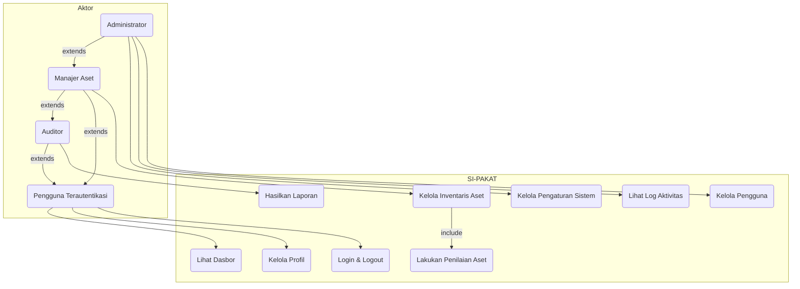

# Dokumentasi Desain Sistem: SI-PAKAT

Dokumen ini menjelaskan desain fungsional dan teknis dari aplikasi SI-PAKAT (Sistem Informasi Pengelolaan Keamanan Aset TIK).

## 1. Analisis Kebutuhan Fungsional (Use Case)

### 1.1. Diagram Use Case


*Catatan: Diagram di atas menggunakan sintaks Mermaid. Anda dapat menyalinnya ke editor yang mendukung Mermaid untuk melihat visualisasinya.*

### 1.2. Daftar Aktor

| Aktor | Deskripsi |
| :--- | :--- |
| **Pengguna Terautentikasi** | Aktor dasar yang mewakili setiap pengguna yang telah berhasil login ke sistem. Aktor lain (Admin, Manajer, Auditor) adalah spesialisasi dari aktor ini. |
| **Administrator** | Peran dengan hak akses tertinggi. Mengelola konfigurasi sistem, pengguna, dan memiliki semua hak akses peran lain. |
| **Manajer Aset** | Peran operasional utama yang bertanggung jawab atas siklus hidup aset, mulai dari penambahan, penilaian, hingga penghapusan. |
| **Auditor** | Peran yang fokus pada pemantauan dan pelaporan. Memiliki hak akses untuk melihat data dan menghasilkan laporan untuk tujuan audit. |

### 1.3. Deskripsi Use Case

| ID | Use Case | Deskripsi | Aktor Utama |
| :-- | :--- | :--- | :--- |
| **UC1** | Login & Logout | Pengguna memasukkan kredensial untuk masuk ke sistem dan dapat keluar untuk mengakhiri sesi. | Pengguna Terautentikasi |
| **UC2** | Kelola Profil | Pengguna dapat melihat dan memperbarui informasi dasar profil mereka sendiri (seperti nama). | Pengguna Terautentikasi |
| **UC3** | Lihat Dasbor | Pengguna melihat halaman utama setelah login yang berisi ringkasan statistik dan visualisasi data aset. | Pengguna Terautentikasi |
| **UC4** | Kelola Inventaris Aset | Aktor dapat membuat data aset baru, melihat daftar aset, memperbarui detail aset, dan menghapus aset dari sistem (CRUD). | Manajer Aset |
| **UC5** | Kelola Pengguna | Aktor dapat membuat, melihat, memperbarui (termasuk peran), dan menghapus akun pengguna lain. | Administrator |
| **UC6** | Lakukan Penilaian Aset | Aktor memasukkan skor untuk 5 kriteria keamanan (kerahasiaan, integritas, dll.). Sistem menghitung total skor dan menentukan nilai aset (Tinggi, Sedang, Rendah). | Manajer Aset |
| **UC7** | Hasilkan Laporan | Aktor memilih filter (kategori/nilai aset) untuk membuat laporan inventaris yang siap dicetak. | Auditor, Manajer Aset |
| **UC8** | Lihat Log Aktivitas | Aktor dapat memantau, mencari, dan melihat detail semua aktivitas penting yang dicatat oleh sistem untuk tujuan forensik. | Administrator |
| **UC9** | Kelola Pengaturan Sistem | Aktor mengonfigurasi parameter global sistem, seperti ambang batas skor untuk klasifikasi nilai aset. | Administrator |

### 1.4. Relasi Antar Use Case

-   **`<<include>>`**: `Kelola Inventaris Aset (UC4)` **mencakup** `Lakukan Penilaian Aset (UC6)`. Ini berarti setiap kali aset baru dibuat atau diperbarui, proses penilaian keamanan adalah bagian wajib dari alur tersebut.
-   **Generalisasi (extends)**: Relasi antar aktor bersifat generalisasi. `Administrator` adalah `Manajer Aset` (mewarisi semua haknya), `Manajer Aset` adalah `Auditor`, dan `Auditor` adalah `Pengguna Terautentikasi`.

---

## 2. Desain Arsitektur Sistem

### 2.1. Arsitektur High-Level

SI-PAKAT menggunakan arsitektur **Client-Server** dengan pemisahan yang jelas antara frontend dan backend.

```mermaid
graph TD
    subgraph "Pengguna"
        Client[Browser Web]
    end
    
    subgraph "Infrastruktur Cloud/Lokal"
        Frontend[Frontend Server <br> (Next.js)]
        Backend[Backend Server <br> (Express.js)]
        DB[(Database <br> MySQL)]
    end

    Client -- HTTPS Request --> Frontend
    Frontend -- REST API Call --> Backend
    Backend -- SQL Query --> DB
    DB -- SQL Response --> Backend
    Backend -- JSON Response --> Frontend
    Frontend -- HTML/JS/CSS --> Client
```

1.  **Client (Browser)**: Pengguna berinteraksi dengan antarmuka aplikasi yang dirender oleh server frontend.
2.  **Frontend Server (Next.js)**: Bertugas menyajikan antarmuka pengguna (UI), mengelola status sesi (cookie), dan berkomunikasi dengan backend melalui panggilan REST API. Sebagian besar logika UI dan interaksi awal terjadi di sini.
3.  **Backend Server (Express.js)**: Bertindak sebagai otak aplikasi. Menerima permintaan dari frontend, menerapkan logika bisnis (validasi, perhitungan skor, otorisasi), dan berinteraksi langsung dengan database.
4.  **Database (MySQL)**: Menyimpan semua data persisten, termasuk pengguna, aset, peran, log, dan riwayat penilaian.

### 2.2. Diagram Komponen & Tanggung Jawab

| Komponen/Modul | Teknologi | Tanggung Jawab Utama |
| :--- | :--- | :--- |
| **UI Components (`src/components`)** | React, ShadCN UI | Menyediakan elemen antarmuka yang dapat digunakan kembali seperti tabel, formulir, dialog, dan kartu. |
| **Routing & Layouts (`src/app`)** | Next.js App Router | Mendefinisikan struktur halaman, rute URL, dan tata letak aplikasi (termasuk sidebar dan header). Melindungi rute berdasarkan sesi pengguna. |
| **State Management (`src/hooks`)** | React Hooks, Context | Mengelola status sesi pengguna di sisi klien (`useSession`) dan status UI lainnya. |
| **API Client (`src/lib/data.ts`)** | Fetch API | Bertindak sebagai lapisan abstraksi untuk semua panggilan ke backend. Secara otomatis menyematkan token otorisasi (JWT) pada setiap permintaan. |
| **Server Actions (`src/lib/actions.ts`)**| Next.js | Menangani logika sisi server yang dipicu oleh interaksi formulir, seperti proses login dan logout, dengan aman mengelola cookie. |
| **API Endpoints (`/routes`)** | Express.js Router | Mendefinisikan semua rute REST API (misal: `/api/users`, `/api/assets`) dan menghubungkannya ke *controller* yang sesuai. |
| **Middleware (`/middlewares`)** | Express.js | Menerapkan logika lintas-fungsi seperti verifikasi token JWT (`authMiddleware`), pengecekan peran (`roleMiddleware`), dan pencatatan aktivitas (`activityLogger`). |
| **Business Logic (`/controllers`)** | Express.js | Berisi logika inti aplikasi: memproses data dari permintaan, berinteraksi dengan model data (database), dan menyiapkan respons. |
| **Database Connection (`/config/db.js`)** | `mysql2` | Mengelola koneksi dan *connection pool* ke database MySQL, memastikan koneksi yang efisien dan andal. |

### 2.3. Alur Data (Contoh: Menambah Aset Baru)

1.  **Pengguna (Manajer Aset)** menekan tombol "Tambah Aset" di UI.
2.  **Frontend (`AssetDialog`)** menampilkan formulir (`AssetForm.tsx`).
3.  Pengguna mengisi detail aset dan skor penilaian, lalu menekan "Simpan".
4.  **Frontend (`AssetTable`)** memanggil fungsi `handleSaveAsset`, yang kemudian memanggil `createAsset` dari `src/lib/data.ts`.
5.  **API Client (`data.ts`)** melakukan `fetch` dengan metode `POST` ke endpoint backend `/api/assets`. Token JWT dari cookie secara otomatis disertakan dalam *header* `Authorization`.
6.  **Backend (Express.js)** menerima permintaan di `/routes/assetRoutes.js`.
7.  **Middleware (`authMiddleware`)** memverifikasi JWT, memastikan pengguna valid.
8.  **Middleware (`roleMiddleware`)** memeriksa apakah peran pengguna adalah "Manajer Aset" atau "Administrator". Jika tidak, permintaan ditolak.
9.  **Controller (`assetController.js`)** menerima data aset.
10. **Controller** memulai transaksi database.
11. **Controller** memasukkan data dasar aset ke tabel `assets`.
12. **Controller** memasukkan data penilaian ke tabel `asset_assessments` dan data detail (misal: spesifikasi hardware) ke tabel anak yang relevan.
13. **Database (MySQL)** mengeksekusi *query* dan mengonfirmasi transaksi berhasil.
14. **Controller** mengirimkan respons JSON `201 Created` berisi data aset yang baru dibuat.
15. **Middleware (`activityLogger.js`)** mencatat aktivitas "Membuat Aset Baru" ke tabel `activity_logs` setelah respons berhasil dikirim.
16. **Frontend** menerima respons, menutup dialog, menampilkan notifikasi sukses, dan memuat ulang daftar aset untuk menampilkan data baru.
